# RoG-उपाttam — Clinical History Assistant

<p align="center">

**A patient-friendly clinical history assistant for structured pre-consultation health information**

<br>

[](https://ayushgautamcodes.github.io/SIH-2026/)
[](https://www.sih.gov.in/)
[](https://developer.mozilla.org/en-US/docs/Web/HTML)
[](https://developer.mozilla.org/en-US/docs/Web/CSS)
[](https://developer.mozilla.org/en-US/docs/Web/JavaScript)

</p>

<p align="center">
  
  
  
  
</p>

---

## Preview

<p align="center">
  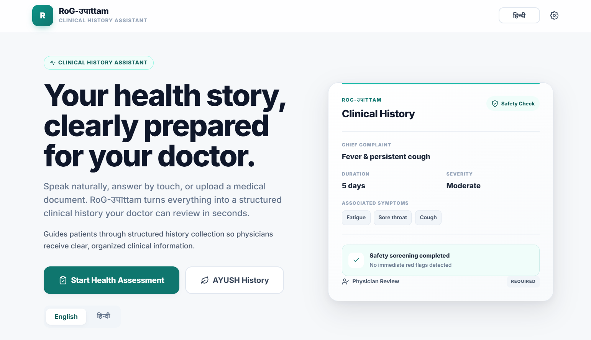
</p>

<p align="center">
  <sub>Patient-focused clinical history assistant interface</sub>
</p>

---

## What is RoG-उपाttam?

RoG-उपाttam helps patients prepare a structured health history before meeting a physician.

Instead of asking patients to remember and explain everything manually, the application guides them through concern-specific questions, accepts voice/touch/text input, allows previous medical documents to be added, performs transparent safety screening, and produces a structured clinical summary for physician review.

---

## Core Workflow

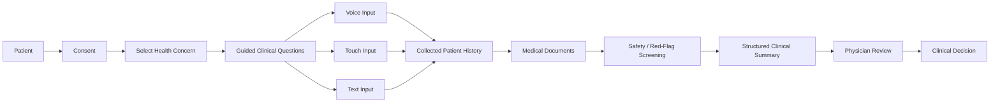

---

## System Architecture

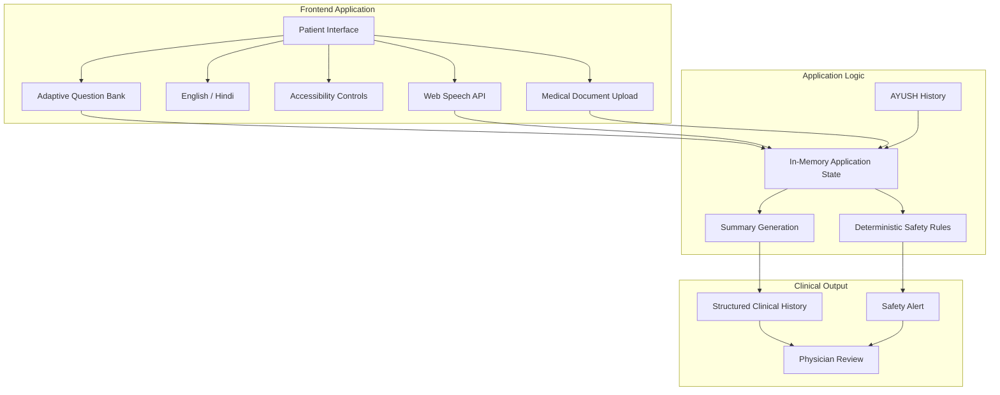

## The current implementation uses in-memory state and a frontend-only architecture; backend services, OCR/AI processing, and production health-record integration are future components.

## Feature Map

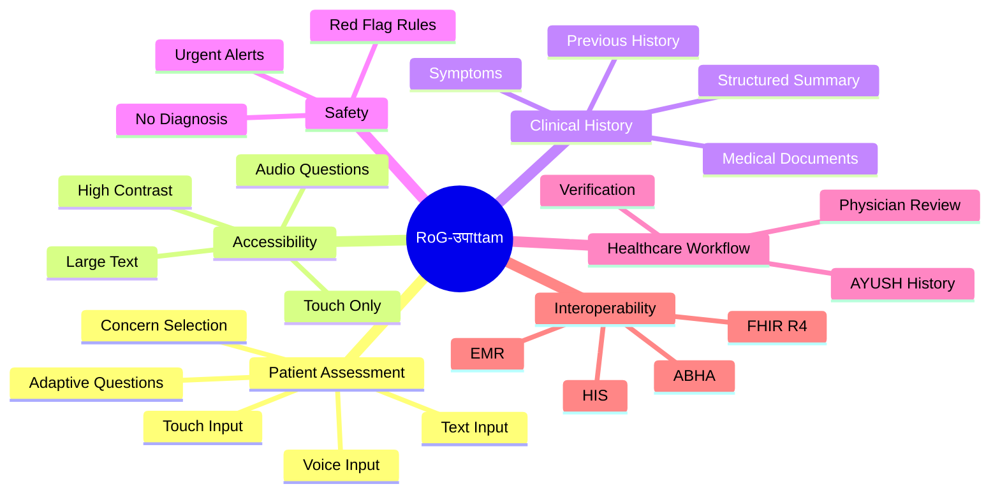

---

## Patient Journey

<p align="center">

| 01         | 02         | 03            | 04         | 05           |
| ---------- | ---------- | ------------- | ---------- | ------------ |
| 🧑 Patient | 🩺 Concern | 🎙️ Questions | 🛡️ Safety | 👨‍⚕️ Review |
| Start      | Select     | Answer        | Screen     | Verify       |

</p>

```text
        START
          │
          ▼
   ┌──────────────┐
   │ Patient      │
   │ enters app   │
   └──────┬───────┘
          ▼
   ┌──────────────┐
   │ Select       │
   │ concern      │
   └──────┬───────┘
          ▼
   ┌──────────────┐
   │ Guided       │
   │ questions    │
   └──────┬───────┘
          ▼
   ┌──────────────┐
   │ Safety       │
   │ screening    │
   └──────┬───────┘
          ▼
   ┌──────────────┐
   │ Structured   │
   │ summary      │
   └──────┬───────┘
          ▼
   ┌──────────────┐
   │ Physician    │
   │ review       │
   └──────────────┘
```

---

## Clinical Safety Flow

The prototype uses deterministic red-flag rules rather than diagnostic prediction. For example, the current rules flag combinations such as severe chest pain with breathing difficulty and sudden severe headache with vision-related symptoms.

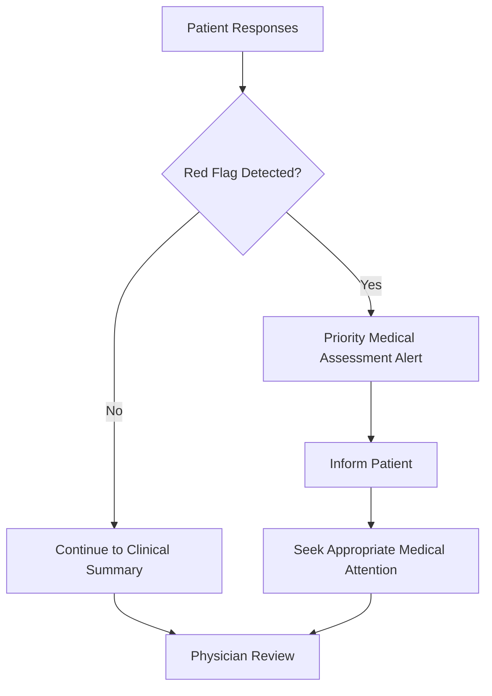

---

## Example Clinical Output

<p align="center">
  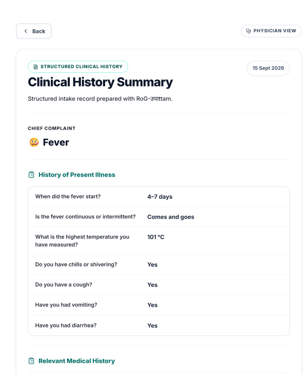
</p>

```text
┌───────────────────────────────────────────────┐
│            CLINICAL HISTORY SUMMARY           │
├───────────────────────────────────────────────┤
│ Chief Complaint                               │
│ Fever and persistent cough                    │
│                                               │
│ Symptoms                                      │
│ • Duration                                    │
│ • Severity                                    │
│ • Associated symptoms                         │
│                                               │
│ Previous History                              │
│ • Medical conditions                          │
│ • Previous episodes                           │
│                                               │
│ Medical Documents                             │
│ • Prescription                                │
│ • Laboratory report                           │
│                                               │
│ Safety Screening                              │
│ • Clinical attention may be required          │
│                                               │
│ Physician Review                              │
│ ✓ Ready for verification                      │
└───────────────────────────────────────────────┘
```

The project organizes collected responses, relevant symptoms, documents and safety screening into a structured clinical summary for physician review.

---

## Technology

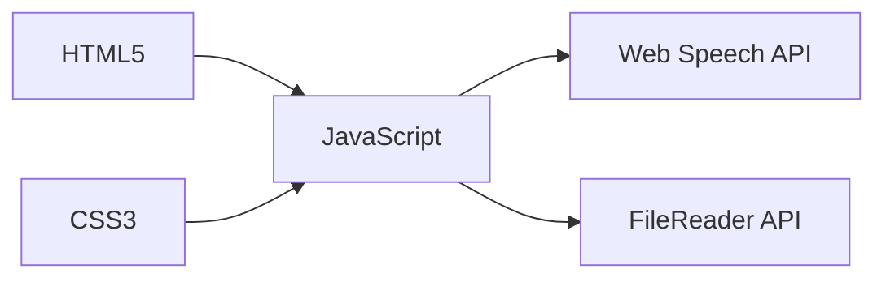

### Current stack

| Layer         | Technology                 |
| ------------- | -------------------------- |
| Structure     | HTML5                      |
| Styling       | CSS3                       |
| Logic         | Vanilla JavaScript         |
| Voice         | Web Speech API             |
| File handling | FileReader API             |
| Language      | English + Hindi            |
| State         | In-memory JavaScript state |

## The base HTML loads `style.css` and `script.js`, while the JavaScript implementation contains the application state, translations, question bank, voice interface, document upload, safety rules and summary generation.

## Project Structure

```text
SIH-2026/
│
├── index.html
├── script.js
├── style.css
│
├── assets/
│   └── screenshots/
│       ├── home.png
│       ├── assessment.png
│       ├── document-upload.png
│       ├── clinical-summary.png
│       └── physician-review.png
│
└── README.md
```

---

## Screenshots

### Home

<p align="center">
  
</p>

### Health Assessment

<p align="center">
  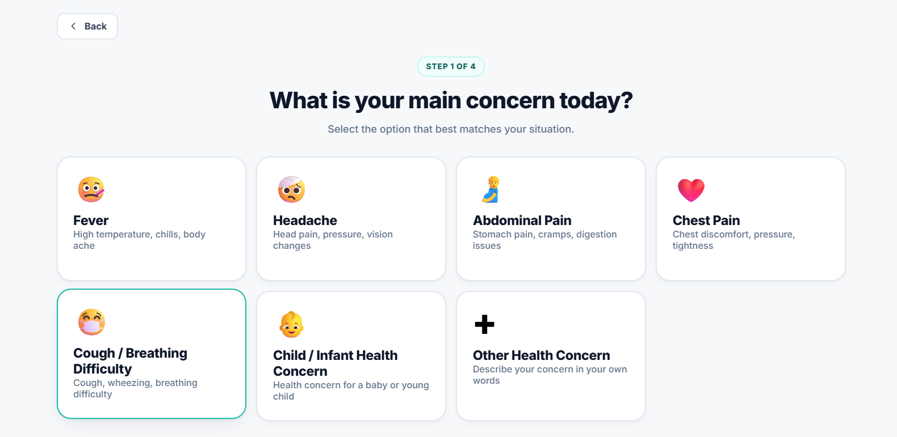
</p>

### Medical Document Upload

<p align="center">
  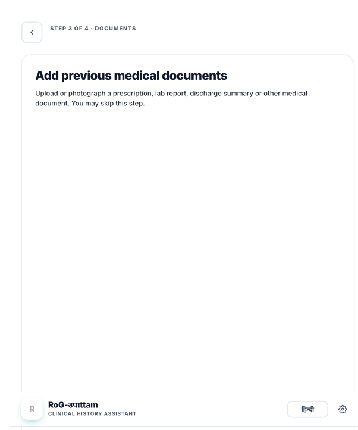
</p>

### Clinical Summary

<p align="center">
  
</p>

### Physician Review

<p align="center">
  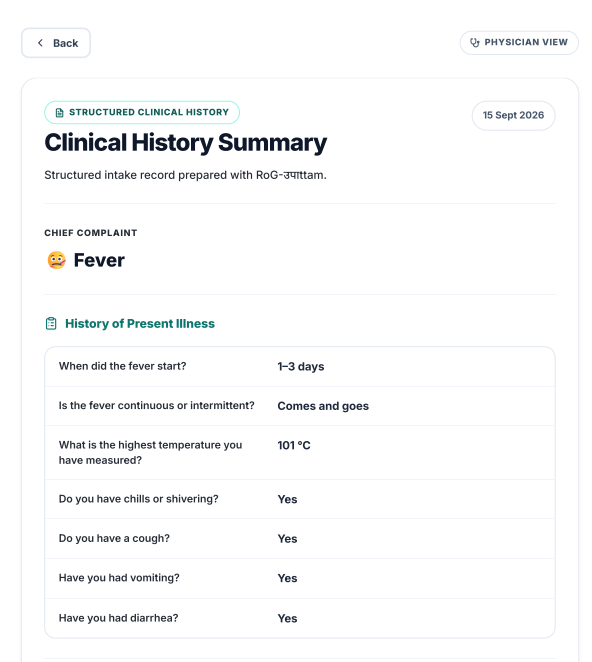
</p>

---

## Screenshots

<table>
<tr>
<td align="center">
<strong>Home</strong><br><br>

</td>

<td align="center">
<strong>Health Assessment</strong><br><br>

</td>
</tr>

<tr>
<td align="center">
<strong>Medical Document Upload</strong><br><br>

</td>

<td align="center">
<strong>Clinical Summary</strong><br><br>

</td>
</tr>

<tr>
<td align="center" colspan="2">
<strong>Physician Review</strong><br><br>

</td>
</tr>
</table>

---

## Production Roadmap

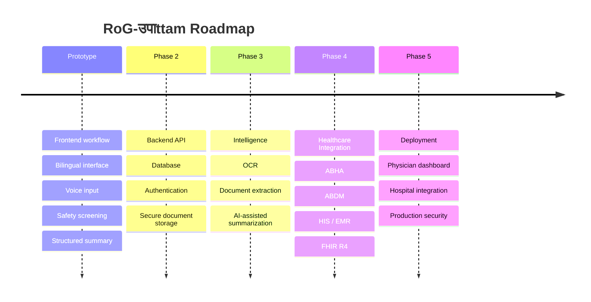

The prototype already exposes planned interoperability areas including ABHA, HIS, EMR and FHIR R4.

---

## Live Demo

<p align="center">

### [Open RoG-उपाttam →](https://ayushgautamcodes.github.io/SIH-2026/)

</p>

---

## Important

> **RoG-उपाttam is not a diagnostic system.**

It is a clinical history-assistance prototype intended to organize patient-reported information for healthcare-professional review.

A qualified healthcare professional remains responsible for diagnosis and treatment decisions.

---

<p align="center">

**Built for Smart India Hackathon 2026**

</p>
